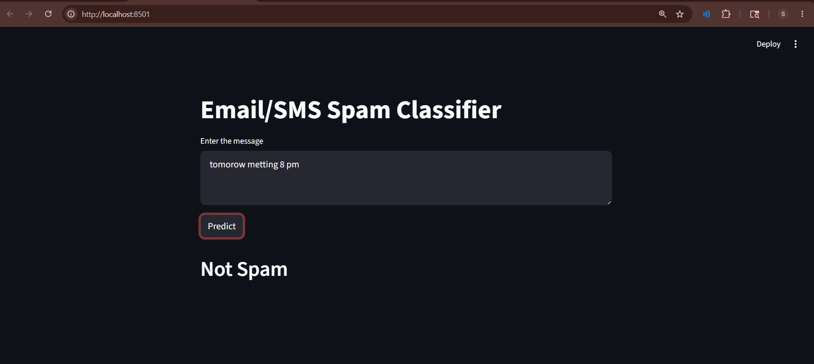

# 📧 Email/SMS Spam Classifier

A Machine Learning based web application that classifies Email/SMS messages as **Spam** or **Not Spam** using **Natural Language Processing (NLP)** and **Streamlit**.

---

# 🚀 Features

- Spam message detection
- Clean and simple UI
- NLP text preprocessing
- Machine Learning prediction
- Real-time classification

---

# 📈 Accuracy Improvement

To improve the accuracy of the spam classifier, different Machine Learning algorithms were tested and compared.

## Algorithms Used

- Naive Bayes
- Logistic Regression
- Support Vector Machine (SVM)
- Random Forest
- Decision Tree
- K-Nearest Neighbors (KNN)

## Techniques Used

- TF-IDF Vectorization
- Text Preprocessing
- Stopword Removal
- Stemming
- Hyperparameter Tuning
- Feature Selection

## Future Optimization

- Use larger datasets
- Apply GridSearchCV for parameter tuning
- Use ensemble learning methods

The best-performing algorithm was selected based on:

- Accuracy Score
- Precision
- Recall
- F1-Score

---

# 🛠️ Technologies Used

- Python
- Streamlit
- Scikit-learn
- NLTK
- Pickle

---

# 📸 Application Preview



---

# 📂 Project Structure

```bash
├── README.md
├── SMS_classifier.ipynb
├── Screenshot.jpg
├── app.py
├── modelfinal.pkl
├── spam.csv
└── vectorizer.pkl
```

---

# ⚙️ How It Works

1. User enters an Email/SMS message
2. Text preprocessing is performed:
   - Lowercase conversion
   - Tokenization
   - Removing stopwords
   - Removing punctuation
   - Stemming
3. TF-IDF vectorization converts text into numerical form
4. Trained ML model predicts the result
5. Output displays:
   - Spam
   - Not Spam

---

# 📦 Installation

## 1️⃣ Clone the Repository

```bash
git clone https://github.com/sumitrathod79228-cyber/Sms-spam-classifier-.git
cd Sms-spam-classifier-
```

## 2️⃣ Install Required Libraries

```bash
pip install -r requirements.txt
```

## 3️⃣ Download NLTK Data

Run Python and execute:

```python
import nltk
nltk.download('punkt')
nltk.download('stopwords')
```

## 4️⃣ Run the Application

```bash
streamlit run app.py
```

---

# 💻 Main Streamlit Application

The Streamlit app loads the trained model and vectorizer for prediction.

---

# 🌟 Future Improvements

- Add model accuracy visualization
- Bulk SMS prediction using CSV upload
- Better UI/UX
- Deploy on Streamlit Cloud

---

# 👨‍💻 Author

**Sumit Rathod**

GitHub: https://github.com/sumitrathod79228-cyber

---

# 📄 License

This project is open-source and available under the MIT License.
